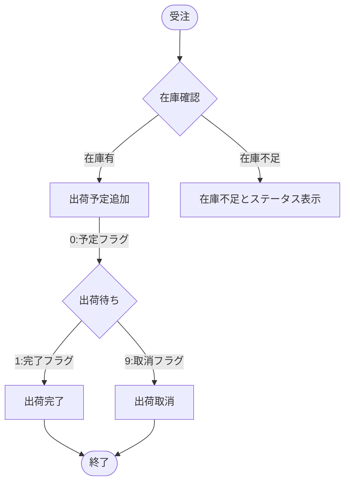

# 業務フロー（テンプレート）

<aside>

このページをコピーして、あなたの業務に合わせて「担当」「入力」「判断基準」「例外」を埋めてください。

</aside>

## 1. フローの前提

- **目的**：：最新の顧客情報(保育園)を共有。
- **対象範囲**：
- **起点（トリガー）**：保育園からの発注、営業情報。
- **完了条件（ゴール）**：保育園に乳児用品を販売する
- **関係者（役割）**：
    - 乳幼児品出荷担当者
    - 営業担当
    - 保育園
- **使用ツール／システム**：
    - My SQL ,php,react,laravel

## 2. 全体像（図）

## 3. 手順（詳細）

| Step | 工程名 | 担当 | 入力（インプット） | 作業内容 | 出力（アウトプット） | 判断基準／SLA |
| --- | --- | --- | --- | --- | --- | --- |
| 1 | 受付 | 営業担当 |  |  |  |  |
| 2 | 内容確認 | 出荷担当 |  |  |  |  |
| 3 | 処理／作業 |  |  |  |  |  |
| 4 | 承認（任意） |  |  |  |  |  |
| 5 | 完了報告／記録 |  |  |  |  |  |

## 4. 例外・差し戻しルール

- **差し戻し条件**：
- **エスカレーション条件**：
- **イレギュラー対応**：

## 5. チェックリスト（運用）

- [ ]  入力情報の必須項目が定義されている
- [ ]  承認者・代理承認者が明確
- [ ]  完了の記録先（台帳／チケット）が決まっている
- [ ]  例外時の連絡先／判断者が決まっている

## 6. 関連資料リンク

-