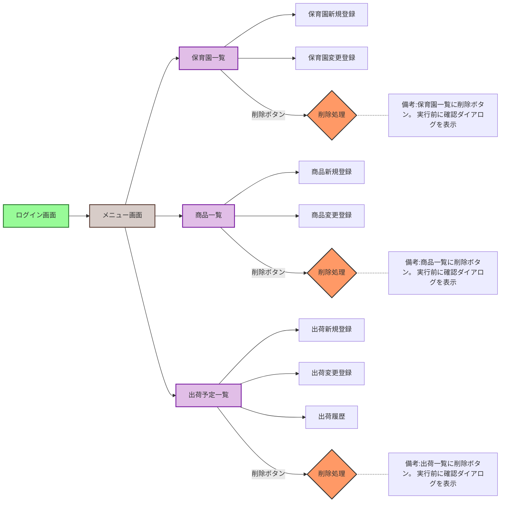
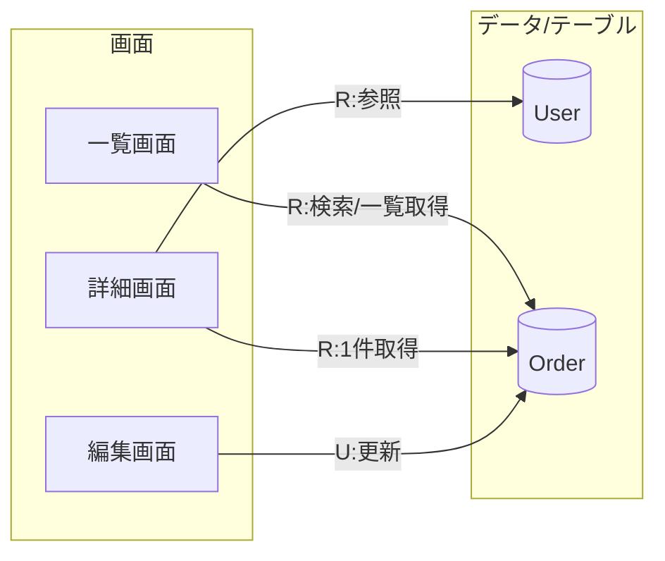

# 画面定義書：連関図（画面遷移・データ連携）テンプレ

<aside>
💡

このページは、画面定義書に付ける「連関図」を作るためのテンプレです。

下のMermaidを、あなたの画面名・データ（テーブル/ID/主キー）に合わせて書き換えてください。

</aside>

## 1) まず決める（最小セット）

- 画面一覧（例：ログイン、トップ、一覧、詳細、編集）
- 画面間のつながり：遷移（ボタン/リンク）
- 画面が扱うデータ：参照/登録/更新/削除（CRUD）

## 2) 画面遷移の連関図（ユーザー操作）

## 3) 画面 × データ（CRUD）の連関図（システム連携）

## 4) 画面間の連携（パラメータ/ID受け渡し）

- 一覧 → 詳細：`orderId`
- 詳細 → 編集：`orderId`
- 編集 → 詳細：更新後に再取得（`orderId`）

## 5) 書き方ルール（おすすめ）

- 画面名は「業務名 + 画面種別」（例：受注一覧、受注詳細）
- 線にラベルを付ける（例：`R`/`C`/`U`/`D`、または「検索」「登録」など）
- データはテーブル名/主要キー（例：`Order(orderId)`）まで書く

## 6) ヒアリング用の記入欄（ここを埋めると図が完成します）

- 対象システム/機能：
- 画面一覧：
- 主要テーブル（またはAPI）：
- 画面→データの操作（CRUD）：
- 画面遷移（起点/条件/例外）：
- 受け渡すパラメータ：